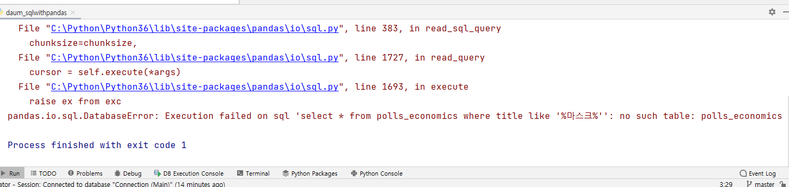

2021년 7월 30일 수업 


하루에 코딩 문제 하나씩 풀기

애자일 강의 다시 한번 듣기


RDB방식 : 현장에서 많이 쓴다. 일반적인 업무(인사, 회계, 은행) : 관계성이 명확한 곳에서 쓴다. A의 값이 명확할 때 관련된 B의 값도 명확할 때 사용한다. 

RDB는 두 개로 분리되어 있다. 그것이 연결하여 사용


NOsql 방식? 다루기가 쉽다. 빅데이터에서 많이 씀. 제조쪽에서 많이 씀

데이터를 무작위로 쌓아야 한다. 

기록을 남기는 방식

빅데이터는 기록된 데이터로 머신러닝을 돌린다. 그래서 Nosql을 돌린다. 

행렬방식으로만 넣을 수 있다. 

최근 몽고DB가 각광받고 있다. 스파크... 분산처리... 데이타양이 테라급일 때 쓴다. 


RDB를 알면 Nosql은 어렵지 않다. 

RDB

엑셀은 열면 sheet 가 있고 행과 열이 있다. 

RDB는 데이타베이스로 구성되어 있고 열면 Table이 있고  record와 column이 있다. 


csv파일이 발전되어 excel이 되고 그것이 발전되어 database가 되었음

엑셀의 sheet가 데이터베이스의 Table이다. 


데이터베이스를 다루기 위해서는 명령어를 써야 한다. 


엑셀에서 sheet를 만드는 방법 = 데이터베이스에서 Table 만드는 방법

데이터베이스에서 테이블 만들 때 제약사항 : 컴퓨터 자원을 최대한 활용하기 위해서(낭비하지 않기 위해서) 데이터 타입을 넣어줘야 한다. 


### Table 의 생성과 삭제

create(drop) table 테이블 이름


위처럼 여러 개의 쿼리문이 들어갈 때 `;`을 넣지 않으면 구분을 하지 못한다. 그래서 각 쿼리문은 세미콜론을 넣어줘야 한다. 


위와 아래는 같은 것임.  즉 실질적으로는 한 줄임

한 데이터베이스에는 여러 개의 테이블이 있을 수 있다. 그래서 insert를 해 줄 때는 가장 먼저 어느 테이블에 넣어줄 것인지를 써주고 컬럼 이름을 쓴 후 데이터값을 써준다. 즉,

```python
insert into 테이블 이름(컬럼이름, 컬럼이름) values (데이터값, 데이터값);
```

형태가 된다. 

이 때 컬럼이름과 데이타값이 하나씩 매칭되는 것에 주의할 것. 


#### 주의할 점

1. sql문의 문법에 맞게 써야 함.
2. 데이터값이 숫자인지 문자인지를 지정해줘야 함. 따라서 문자일 때는 ''(싱글 쿼테이션)으로 감싸줘야 한다.(데이터 타입에 의존적 즉 데이터타입에 따라 넣어줘야 한다. )


데이터타입이 다를 경우 위와 같이 에러문이 뜬다. 

3. 컬럼이름과 데이터값을 잘 매칭해줘야 한다. (순서가 뒤바뀌어도 매칭만 잘하면 됨)


아무것도 존재하지 않는 값 : null 

그래서 위와 같이 쓰지 않고 아래와 같이 쓴다. 


판다스에서 결측치를 가져올 때 'is null'을 활용할 수 있다. 


null 이 아닌 값을 불러오는 명령문은 위와 같다. 

where 조건에서 null 값은 계산에서 빠진다. 즉 is null 만 쓸 수 있다. 


# 정리

데이터값의 타입에 따라서 where문 뒤에 아래와 같이 쓸 수 있다. 

* 데이터값이 문자면 `=, !=, like`를 쓸 수 있고

* 데이터값이 null이면 `is null 또는 is not null`을 쓸 수 있고

* 데이터값이 숫자면 `<, >, =`을 쓸 수 있다. 

  예) 


위와 같이 like를 쓰면 같은 결과가 나오기도 하지만 like가 좋은 점은 %를 같이 써서 더 포괄적으로 조회할 수 있다. 


위와 같이 기억나는 부분만 쓰고 %를 쓰면 기억나는 부분을 포함한 문자를 조회해준다. 


> where문에서 `and`, `or`를 쓸 수 있다.

```
select * from  members_test where age >= 25 and name like '%d%';
```

 위는 나이가 25세 이상이면서 이름에 d가 들어간 사람의 데이터를 조회하는 명령문

where 문에서 and를 여러번 같이 써도 된다. 하지만 주로 2개 정도 쓴다. 

where문에서 정규표현식을 써서 더 자세하게 찾을 수 있다. 

딥러닝에서 regular expression(레귤러 익스프레션, 정규표현식) --->  쿼리문, 자바스크립트 등에도 쓴다. 데이터 마이닝에도 쓴다. 


## delete 문

delete를 쓸 때는 먼저 select문을 먼저 써서 확실하게 확인한 후 실행한다. 

delete from 테이블명 where 삭제할 부분;


delete는 record를 삭제하는 것이고

drop은 table을 삭제하는 것이다. 

아래는 테이블 안의 모든 정보를 삭제하는 명령문

```
delete from information;
```

```
drop table information;
```

위는 information 테이블을 삭제하는 명령문


```
from sklearn import datasets
```

[sklearn.datasets](https://scikit-learn.org/stable/datasets/index.html) 모듈에는 대표적인 sample dataset들을 제공하고 손쉽게 다운로드 및 로딩할 수 있다.

scikit-learn의 Datasets에서 make로 시작하는 함수는 numpy ndarray 타입의 X(Feature)와 y(label)를 반환하며 load 또는 fetch로 시작하는 함수는 Bunch 객체를 반환한다.

Bunch 객체는 파이썬의 딕셔너리와 유사하며 keys()를 통해 불러올 수 있는 key값을 확인할 수 있다. 

```python
dataset.keys()

[출력] dict_keys([‘data’, ‘target’, ‘target_names’, ‘DESCR’, ‘feature_names’, ‘filename’])
```


Bunch 객체에서 공통적으로 사용되는 키는 다음과 같다.

- data : X 데이터(2차원 Numpy ndarray) : `학습해야 할 feed용 데이터`
- target : Y 데이터(1차원 Numpy ndarray) : `label 데이터, 예측해야 할 데이터`
- feature_names : X 데이터에 대한 정보(컬럼명)
- target_names : Y 데이터에 대한 정보(분류 데이터에만 존재)
- DESCR : 데이터 설명문(문자열)


위 데이터는 디버깅모드의 Console에서 확인해 볼 수 있다. 


```py
boston.feature_names
```


```py
data = boston.data
data.shape
```


컬럼이 13개고 레코드가 506개 임을 알 수 있다. 

```python
 df.head(5)
```


```python
df.describe()
```


## group by

grouping을 하게 되면 성격이 바뀌기 때문에 특정 함수를 사용해야 한다. 

group by를 하여 쓸 수 있는 함수(function) : count, sum


>  실습


```python
import sqlite3

connect = sqlite3.connect('../db.sqlite3')

import pandas as pd

df_mask = pd.read_sql_query("select * from polls_economics where title like '%마스크%'", connect)
df_labor = pd.read_sql_query("select * from polls_economics where title like '%노동%'", connect)
df_income = pd.read_sql_query("select * from polls_economics where title like '%소득%'", connect)

df_mask.to_sql('daum_mask', connect, if_exists='replace')
df_labor.to_sql('daum_labor', connect, if_exists='replace')
df_income.to_sql('daum_income', connect, if_exists='replace')

connect.close()
```


판다스를 이용하여 DB에서 데이터를 불러오는 코드를 짠 뒤 실행을 했는데 아래와 같은 오류메시지가 나왔다. 




pandas.io.sql.DatabaseError: Execution failed on sql 'select * from polls_economics where title like '%마스크%'': no such table: polls_economics

DB Brewser에서 sql문을 써서 select를 했을 때 데이터값이 나왔는데 polls_economics라는 폴더가 없다고 나오는 것이다. 

경로문제인가 싶어서 살펴봤더니 scraping 폴더에 python파일을 만들어야 수업때 했던 조건과 같은데 scraping 폴더보다 한단계 위에 python파일을 만들어 코딩을 했다는 것을 발견했다. 그래서 scraping 폴더로 옮기고 '이제 됐겠지' 생각하면서 실행해 봤는데 여전히 같은 메시지가 떴다. 

그래서 결국 해결방법을 찾지 못하고 잠자리에 들었다. 

다음날 'pandas.io.sql.DatabaseError no such table'로 다시 구글링을 해봤더니 대부분 경로문제를 지적하는 것이다. 그래서 다시 경로문제를 살펴봤다. 탐색기에서 보니 db.sqlite3 가 두 개가 있었다. DB Browser를 통해 데이터값을 보니 내가 짠 코드의 경로에 있는 db.sqlite3에는 polls_economics table이 없다는 것을 확인했다. 

결국 connect = sqlite3.connect('./db.sqlite3')로 수정하고 나서야 문제가 해결이 됐다. 


수업때 강사님이 `경로`에 대해 하신 말씀:

>프레임워크에 속해있지 않는 실행파일은 자기가 중심이고
>
>프레임워크는 프레임워크가 지정한 위치가 시작점이며 자기가 경로를 가지고 있다. 그래서 시작점을 알아야 경로를 알 수 있다. 
>

아직 이 의미를 잘 모르니 `경로문제`에 대해 더 알아봐야겠다. 


지난 프로젝트할 때 폴더를 인식하지 못했는데 그것도 경로문제가 아닐까? 


질문 1. count와 sum의 차이?

질문 2. sqlite3에 제대로 connect 됐는지 여부를 알 수 있는 방법? 경로가 잘못됐어도 객체는 형성이 된다. 

질문 3. sql 문으로 table 생성하면 migrate를 할 필요가 없는지?


**DataBase 마이그레이션**
Django에서 Model 클래스를 생성하고 난 후, DB와 연동시킬 수 있도록 해당 모델에 대응하는 테이블을 똑같이 생성해줘야 한다. 여기서 **Python 모델 클래스의 수정 (및 생성 )을 DB에 적용하는 과정을 Migration**이라고 한다.

