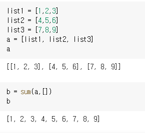

2021년 8월 1일 공부


### 데이터 추출을 클릭 한번에 할 수 있는 확장프로그램 : LISTLY

LISTLY는 초보 마케터, 고급 개발자 모두를 위한 웹 데이터 추출 서비스입니다. 클릭 한 번이면, 몇 초만에 웹 페이지를 엑셀로 변환시켜주는 알고리즘을 기반으로 작동합니다. 추출된 데이터는 주로 연락처수집, 가격모니터링, 제품리스트업, 마케팅, 연구 등 다양한 업무에 활용됩니다.


### 함수의 파라미터 순서(feat. *args, **kwargs)

함수의 파라미터 순서 : `일반 변수, * 변수, **변수` 

  변수가 확실한 특정 변수는 맨 앞에 온다는 것이 핵심!!!


>  *변수 

* argument에 여러 개의 인자가 들어갈 때 쓴다. 

* 함수 내부에서는 해당 변수를 `튜플`로 처리
* args는 `argument`의 줄임말


>  **변수

* `키워드 = ' '`로 입력할 경우에 그것을 각각 키와 밸류로 가져오는 `딕셔너리`로 처리 
* kwargs는 `keyword argument`의 줄임말


## 리스트 속 리스트를 한 개의 리스트로 만드는 방법

리스트를 원소로 가지고 있는 리스트를 a라 하고 이 리스트를 풀어서 만들어질 리스트를 b라고 하면 다음과 같은 코드로 정리할 수 있다. 

```python
b = sum(a,[])
```

예)



